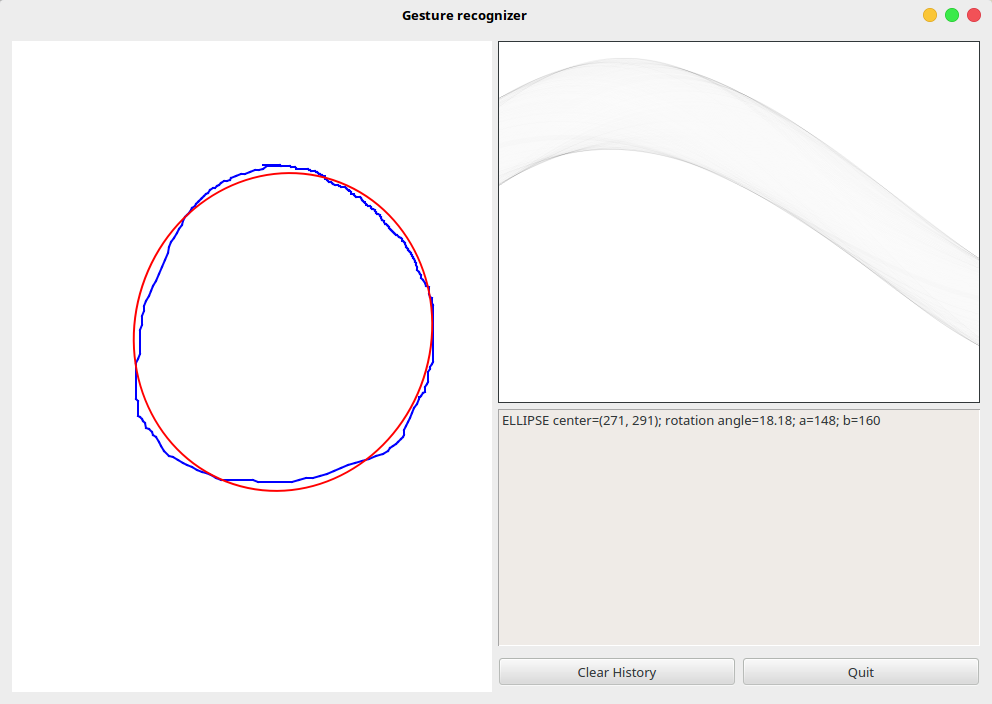

# Gesture recognizer
[](./LICENSE)

Recognition library of simple geometric images (gestures) and graphical interface to interact with it.

## Overview

Project divided in two parts:
* Graphical user interface
* Recognition library (librecog)

Depends only from Qt4 and uses c++98 standard

## Usage



Main window consist of three parts:
* Area to draw images - drawing starts with any mouse button pressed, after releasing button recognition process starts immediately 
* Hough transformation matrix of the processed image
* History of previously recognized images

Recognized graphical primitive drawn on the same area with red color.

Supported primitives:
* Line
* Rectangle
* Ellipse (with rotation)

Algorithm and references can be found [here](./doc/algorithm-desc-ru.md).

Tested under Debian 8 Jessie with `Qt 4.8.6` and `gcc 4.9.2`
## Build

```
mkdir build && cd build
qmake ..
make
```
Then launch interface in `gui/gesture-recognizer`
### Documentation

To build doxygen documentation do in project source root:
```
doxygen doxygen.conf
```
Generated files will be placed in `./doc`

## License 

This code is licensed under the [MIT license](./LICENSE)
